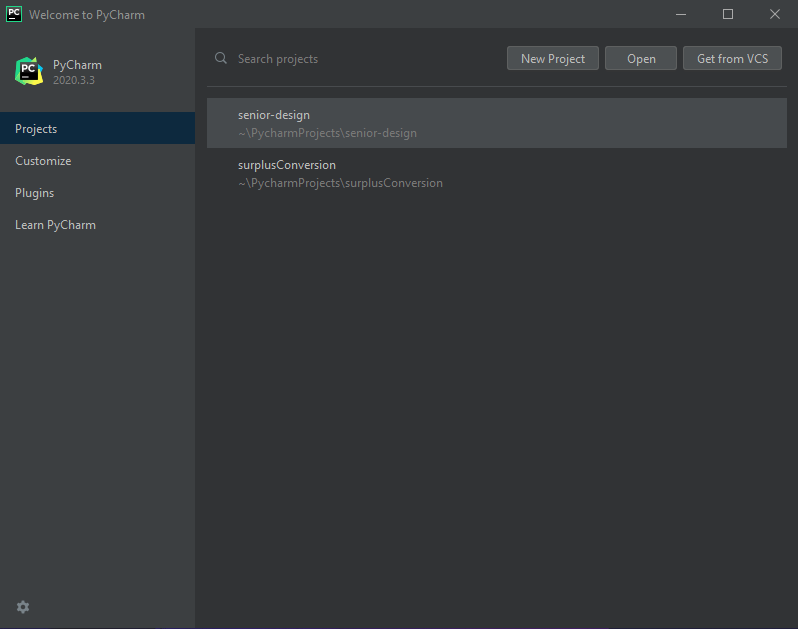
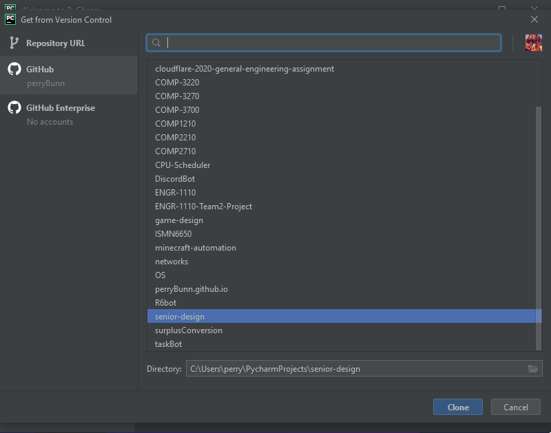
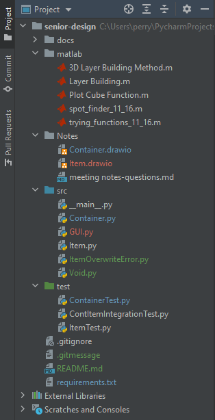

# Links
- [Changelog](changelog.md)

# Getting Started
## Git (VCS)
Download: https://git-scm.com/downloads

`git clone https://github.com/perryBunn/senior-design.git`

Examples:
- `git pull` - Will get the most recent code from the remote
- `git checkout -b <chris-dev>` - Will create a new repository
- `git chechout <chris-dev>` - Will move working branches to `<chris-dev>`
- `git add` - Will stage the files you've changed for commit
- `git commit` - Will "finalize" changes
- `git push` - Sends the changes from your commits to the remote

## IDE
I recommend using [PyCharm](https://www.jetbrains.com/pycharm/). Once installed and opened it should look similar to this.

Either get from VCS or open file (if you have already cloned the repo)

Hit clone and the project is now ready for you to work on!
If done right your project files should look something like this

